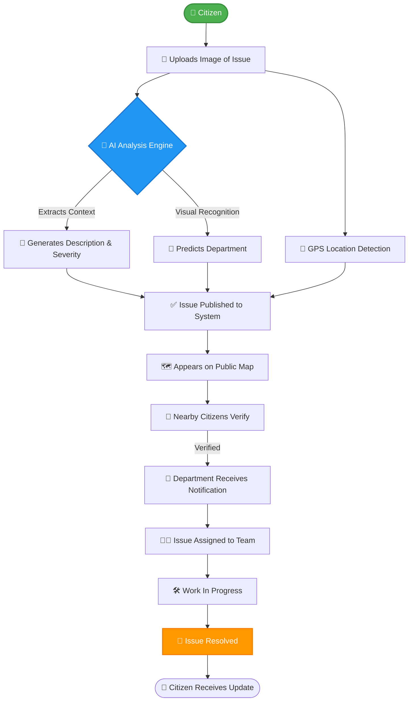
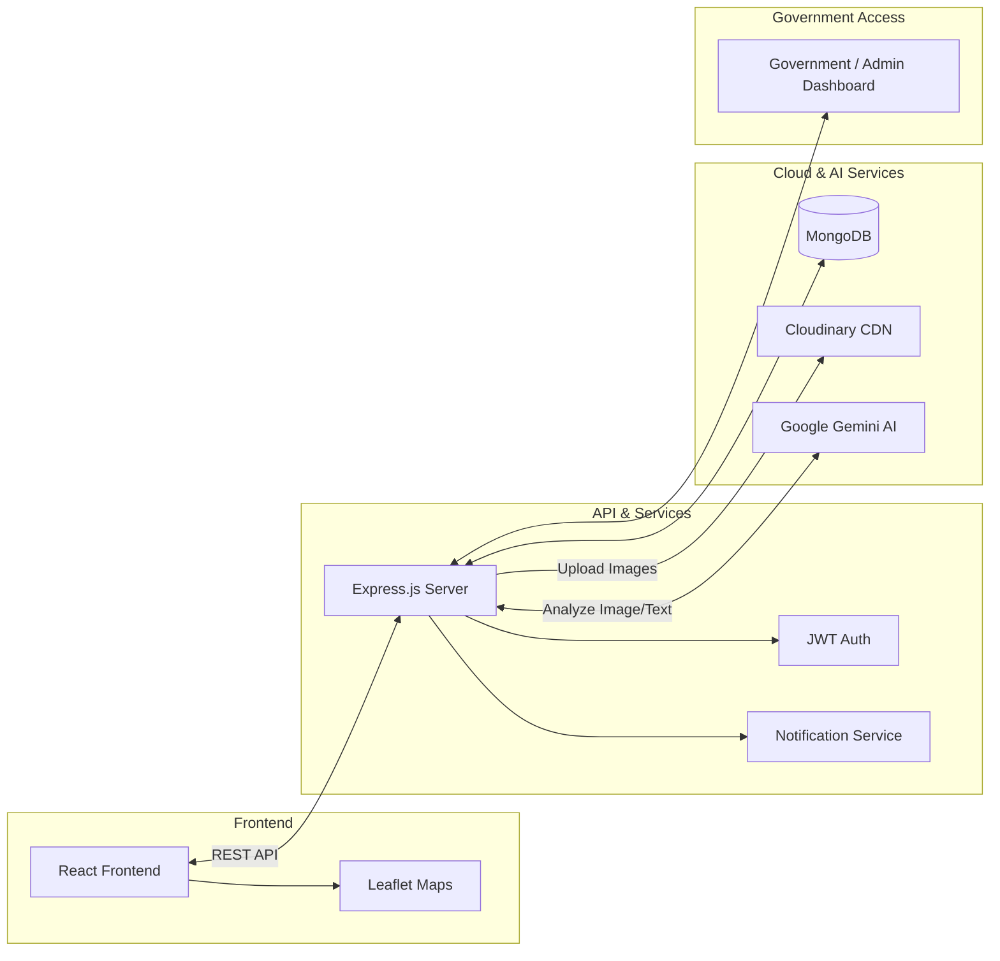
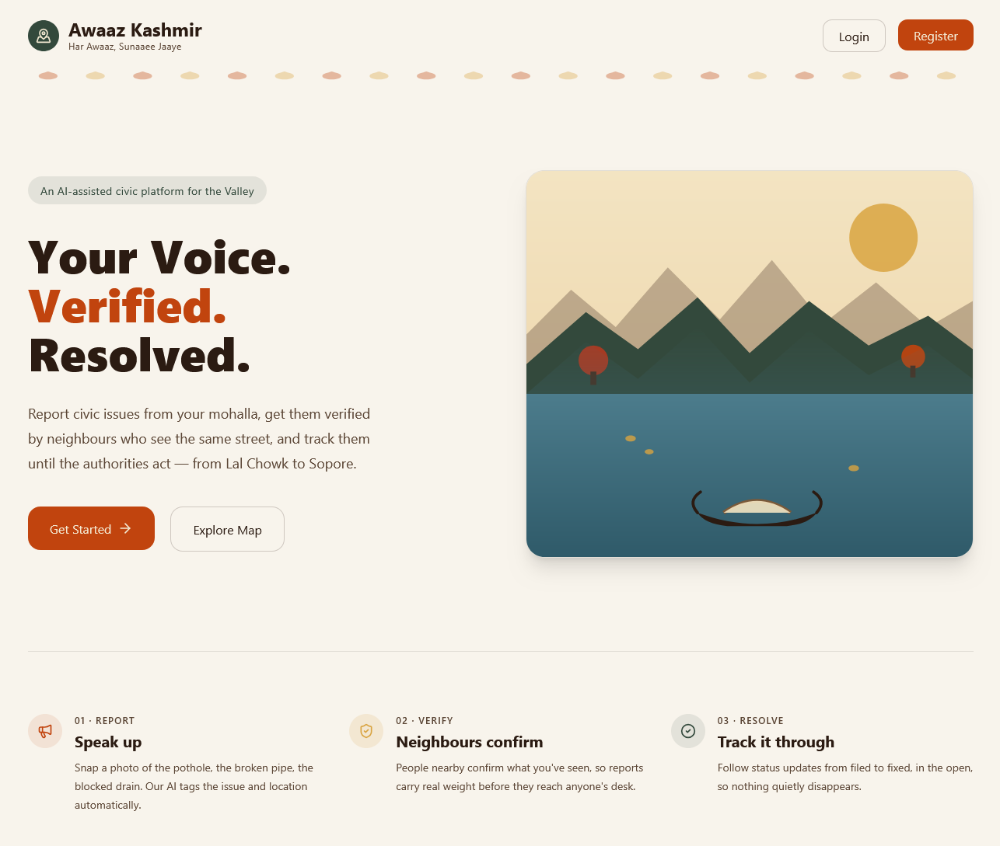
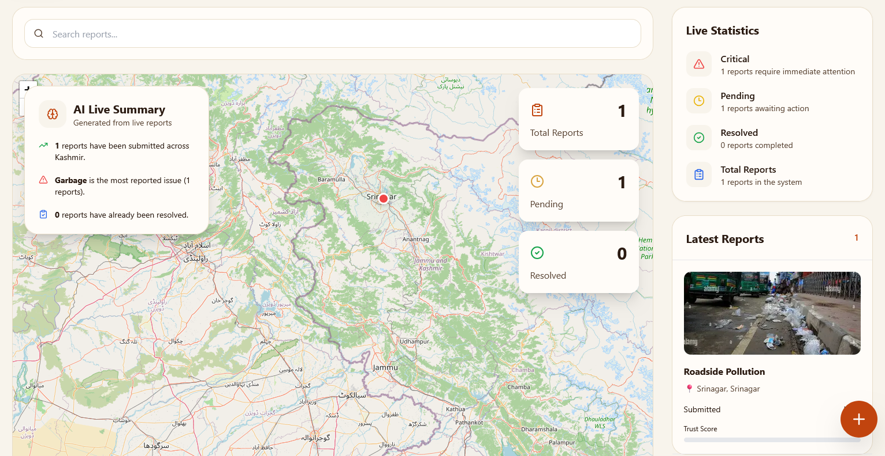
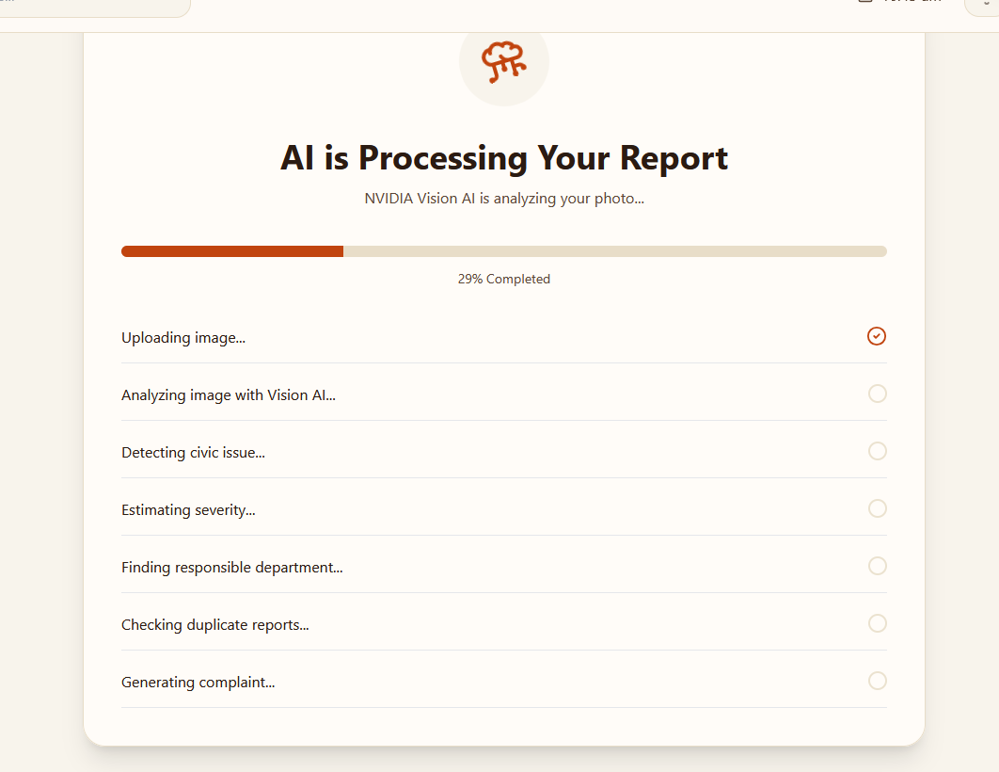
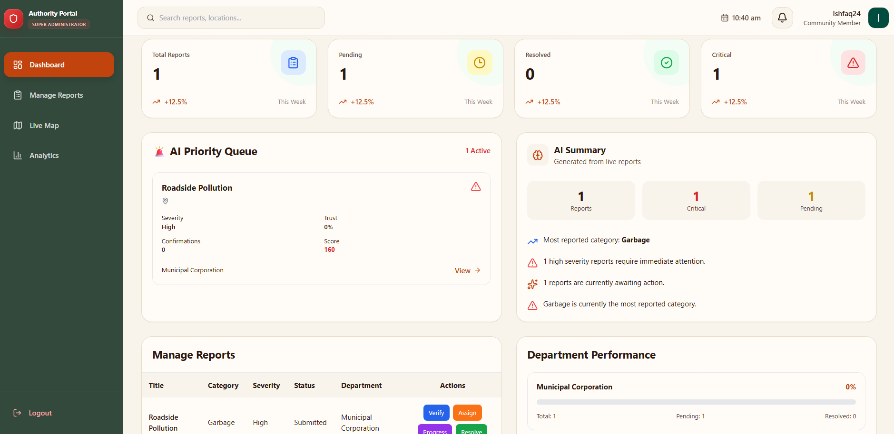

<div align="center">
  

  # Awaaz AI (Awaaz Kashmir)
  **"Your Voice. Verified. Solved."**

  [](https://example.com/hackathon)
  [](https://opensource.org/licenses/MIT)
  [](https://reactjs.org/)
  [](https://nodejs.org/)
  [](https://www.mongodb.com/)
  [](https://deepmind.google/technologies/gemini/)
  
  <p align="center">
    An AI-powered civic issue reporting and resolution platform designed to bridge the communication gap between citizens and government departments.
  </p>
</div>

---

## 📑 Table of Contents

<details>
<summary>Click to expand</summary>

- [Project Description](#-project-description)
- [The Problem](#-the-problem)
- [Our Solution](#-our-solution)
- [Key Features](#-key-features)
- [How It Works](#-how-it-works)
- [System Architecture](#-system-architecture)
- [Tech Stack](#-tech-stack)
- [AI Features](#-ai-features)
- [User Roles](#-user-roles)
- [Dashboards](#-dashboards)
- [Project Structure](#-project-structure)
- [Installation](#-installation)
- [Environment Variables](#-environment-variables)
- [API Overview](#-api-overview)
- [Database Design](#-database-design)
- [Security](#-security)
- [Scalability](#-scalability)
- [Future Roadmap](#-future-roadmap)
- [Real World Impact](#-real-world-impact)
- [Why This Project Matters](#-why-this-project-matters)
- [Hackathon Value](#-hackathon-value)
- [Screenshots](#-screenshots)
- [Demo](#-demo)
- [Team](#-team)
- [Contributing](#-contributing)
- [License](#-license)
- [Acknowledgements](#-acknowledgements)

</details>

---

## 📖 Project Description

Awaaz AI is an AI-powered civic issue reporting and resolution platform designed to bridge the communication gap between citizens and government departments.

Instead of posting complaints on WhatsApp, Facebook, Instagram, X (Twitter), or relying on phone calls, citizens can simply capture a photo of a civic issue.

The platform automatically:
- **Detects the issue** using AI.
- **Generates a complaint description**.
- **Estimates severity** and urgency.
- **Identifies the responsible government department**.
- **Detects location** via GPS mapping.
- **Publishes the issue** on a public map.
- **Notifies nearby citizens** to verify the report.
- **Sends alerts** directly to authorities.
- **Tracks issue resolution** from start to finish.

---

## ⚠️ The Problem

> [!WARNING]
> Civic issues in many regions go unresolved because the existing infrastructure for reporting them is decentralized, unrecorded, and inefficient.

Currently, citizens face massive hurdles when trying to report public grievances:

- **WhatsApp Group Chaos:** Citizens post issues on random WhatsApp groups where they are ignored or drowned out by noise.
- **Disappearing Complaints:** Complaints get lost in infinite chat histories with zero traceability.
- **No Accountability:** Without a public ledger of issues, authorities face no pressure to act.
- **Unrecorded Phone Calls:** Helplines ring endlessly or calls go unrecorded, leaving no proof of the complaint.
- **Incomplete Information:** Departments often receive vague complaints (e.g., "pipe broken") without exact location or severity context.
- **Duplicate Complaints:** Multiple people report the same pothole, wasting valuable administrative resources.
- **Fake Complaints:** Malicious actors post fake issues, reducing trust in citizen reporting.
- **No Centralized Dashboard:** The government lacks a holistic, real-time view of the city's problems.
- **Lack of Feedback Loop:** Citizens never know whether the issue they reported is being addressed or has been resolved.
- **Inability to Prioritize:** Governments cannot prioritize issues because there is no data on severity or public impact.
- **Zero Analytics:** Lack of data prevents long-term planning and predictive maintenance.
- **No Regional Heatmaps:** Authorities cannot visually identify which areas need the most intervention.
- **No Public Transparency:** Citizens cannot see what the government is fixing in their neighborhood.
- **Rural Exclusion:** Rural citizens, who often lack access to digital literacy, struggle the most to navigate complex grievance portals.

---

## 💡 Our Solution

Awaaz AI solves every one of these problems by centralizing, automating, and verifying civic complaints through the power of Artificial Intelligence.

### Traditional Method vs. Awaaz AI

| Feature | Traditional Methods (WhatsApp, X, Calls) | 🚀 Awaaz AI Platform |
| :--- | :--- | :--- |
| **Data Entry** | Manual, tedious, often incomplete typing | Instant automated description via AI image analysis |
| **Platform** | Scattered across WhatsApp, Social Media, Calls | Single, centralized platform for all issues |
| **Accountability** | None. Messages get lost | Public ledger with live tracking |
| **Location Data** | Vague text descriptions | Precise GPS coordinates & interactive map pin |
| **Department Routing** | Citizen has to guess who to call | AI automatically tags the correct department |
| **Issue Severity** | Subjective or completely missing | AI estimates severity (Low, Medium, High, Critical) |
| **Duplicate Prevention** | High chance of multiple identical reports | AI semantic & spatial duplicate detection |
| **Verification** | Unverified, prone to fake news | Community-driven verification by nearby citizens |
| **Status Updates** | Ghosted. No updates provided | Automated SMS/Push notifications at every stage |
| **Prioritization** | First-come, first-serve (or randomly picked) | Dashboard sorts by severity and community votes |
| **Analytics & Data** | None | Real-time analytics, charts, and resolution metrics |
| **Heatmaps** | Non-existent | Visual hotspot detection for systemic issues |
| **Transparency** | Closed doors | 100% public transparency for resolved vs. open issues |
| **Accessibility** | Requires knowing the right official | Universal access: Snap, Upload, Done. |
| **Admin View** | Stacks of paper or messy spreadsheets | Beautiful, action-oriented digital dashboards |

---

## ✨ Key Features

- **AI Issue Detection:** Upload a photo, and our AI automatically recognizes the problem (e.g., broken pipe, pothole, fallen tree).
- **Image Upload:** Seamless, optimized image capture directly from the mobile browser or gallery.
- **AI Generated Complaint:** Automatically drafts a professional, detailed complaint description based on the image.
- **AI Severity Analysis:** Predicts the impact level, helping authorities prioritize critical infrastructure failures.
- **Department Prediction:** AI routes the issue directly to PDD, PHE, R&B, SMC, etc., avoiding administrative ping-pong.
- **GPS Location Detection:** Auto-captures precise coordinates when the photo is taken.
- **Interactive Map:** A public, live Leaflet map showing all reported issues in the region with colored status pins.
- **Nearby Citizen Verification:** Geofenced alerts notify nearby users to verify the issue, preventing spam.
- **Live Status Tracking:** Track your issue through stages: *Reported ➔ Verified ➔ Assigned ➔ In Progress ➔ Resolved*.
- **Smart Notifications:** Real-time updates via email/push notifications whenever an issue's status changes.
- **Heatmaps:** Visual density maps showing the most affected regions, helping policymakers allocate budgets.
- **Analytics Dashboard:** Deep insights into resolution times, common issues, and department performance.
- **Department Dashboard:** Specialized views for department heads to manage their specific assigned tasks.
- **User Dashboard:** A personal timeline of all issues reported and verified by the citizen.
- **Admin Dashboard:** God-view for Super Admins to oversee the entire system, manage roles, and monitor health.
- **Duplicate Detection:** AI checks for similar images and coordinates to merge duplicate reports.
- **Report Timeline:** A transparent chronological ledger of every action taken on an issue.
- **Community Verification:** Crowdsourced moderation ensures high data quality.
- **Role Based Authentication:** Secure JWT-based access for Citizens, Authorities, and Admins.
- **Mobile Friendly UI:** Designed mobile-first, ensuring it works perfectly on every smartphone.

---

## 🔄 How It Works



---

## 🏗️ System Architecture



---

## 🛠️ Tech Stack

### Frontend
| Technology | Usage | Reason for Selection |
| :--- | :--- | :--- |
| **React** | UI Library | Component-based, highly scalable, massive ecosystem. |
| **Tailwind CSS** | Styling | Rapid UI development, maintainable utility classes. |
| **Zustand / Redux** | State Management | Predictable state container for complex dashboard data. |
| **Lucide / HeroIcons**| Icons | Clean, modern, scalable vector icons. |

### Backend
| Technology | Usage | Reason for Selection |
| :--- | :--- | :--- |
| **Node.js + Express** | Server | Fast, non-blocking I/O, perfect for RESTful APIs. |
| **MongoDB** | Database | Flexible document schema, ideal for dynamic report data. |
| **Mongoose** | ORM | Elegant MongoDB object modeling for Node.js. |
| **JWT** | Authentication | Stateless, secure role-based access control. |

### Integrations & Services
| Technology | Usage | Reason for Selection |
| :--- | :--- | :--- |
| **Google Gemini AI** | AI Engine | State-of-the-art multimodal AI for image analysis & text generation. |
| **Cloudinary** | Image Storage | Optimized CDN, automatic image compression, fast delivery. |
| **Leaflet.js** | Maps | Lightweight, mobile-friendly interactive maps. |
| **Chart.js / Recharts**| Charts | Beautiful, responsive data visualization for analytics. |

### Deployment & DevOps
| Technology | Usage | Reason for Selection |
| :--- | :--- | :--- |
| **Docker** | Containerization | Consistent environments across dev, staging, and production. |
| **Vercel / Netlify** | Frontend Hosting | Edge network, fast CI/CD pipeline for React. |
| **Render / Heroku** | Backend Hosting | Easy deployment of Node services. |

---

## 🧠 AI Features

Awaaz AI leverages **Google Gemini** as its core intelligence engine.

- **Image Understanding:** Analyzes uploaded photos to determine the exact nature of the civic issue.
- **Severity Detection:** Classifies the issue as `Low`, `Medium`, `High`, or `Critical` based on visual cues (e.g., a massive sinkhole vs. a small pothole).
- **Issue Classification:** Categorizes the problem into predefined groups (e.g., Water, Electricity, Roads, Sanitation).
- **Complaint Generation:** Drafts a formal, polite, and detailed complaint text automatically, removing the burden from the citizen.
- **Department Recommendation:** Intelligently maps the issue category to the specific local government department responsible for fixing it.
- **Duplicate Detection (Upcoming):** Vector embeddings of images and text to flag if an issue has already been reported nearby.
- **Future AI Possibilities:** Predictive maintenance models to foresee infrastructure failures before they happen based on historical reporting data.

---

## 🎭 User Roles

Awaaz AI features robust Role-Based Access Control (RBAC):

1. **Citizen 👤**
   - Can report issues.
   - Can verify nearby issues.
   - Can view the public map and their personal reporting history.
2. **Authority / Worker 👷**
   - Field workers assigned to specific tasks.
   - Can update the status of assigned issues (e.g., "In Progress", "Resolved").
   - Can upload proof-of-resolution photos.
3. **Department Admin 🏢**
   - Manages issues assigned to their specific department (e.g., Head of Water Department).
   - Can reassign tasks, view department analytics, and communicate with citizens.
4. **Super Admin 👑**
   - God-view access.
   - Can manage all users, departments, and system configurations.
   - Has access to global analytics and heatmaps.

---

## 📊 Dashboards

- **Citizen Dashboard:** A personal feed showing the real-time status of their reports, community points earned, and a localized map of their neighborhood.
- **Department Dashboard:** A kanban-style board for department heads to view incoming, in-progress, and resolved tickets specifically routed to their agency.
- **Admin Dashboard:** A high-level control panel to manage user roles, oversee cross-department performance, and handle system flags/spam.
- **Analytics Dashboard:** Beautiful charts (bar, pie, line) displaying average resolution times, most common issue types, and geographical density heatmaps for policymakers.

---

## 📁 Project Structure

```text
awaaz-kashmir/
├── client/                 # React Frontend
│   ├── public/             # Static assets
│   ├── src/
│   │   ├── assets/         # Images, icons
│   │   ├── components/     # Reusable UI components (Buttons, Cards, Modals)
│   │   ├── pages/          # Full page views (Home, Dashboard, Map)
│   │   ├── context/        # React Context (Auth, Theme)
│   │   ├── hooks/          # Custom React hooks
│   │   ├── services/       # API client calls (Axios)
│   │   ├── utils/          # Helper functions
│   │   └── App.jsx         # Main application router
│   ├── package.json
│   └── tailwind.config.js
├── server/                 # Express Backend
│   ├── config/             # DB and Environment config
│   ├── controllers/        # Route logic (Auth, Reports, AI)
│   ├── models/             # Mongoose Schemas
│   ├── routes/             # Express API routes
│   ├── middlewares/        # Auth, File Upload, Error Handling
│   ├── utils/              # AI Prompts, Helpers
│   ├── .env.example
│   ├── server.js           # Entry point
│   └── package.json
├── docs/                   # Additional documentation & assets
├── docker-compose.yml      # Docker orchestration
└── README.md               # You are here!
```

---

## ⚙️ Installation

Follow these steps to run the project locally.

### 1. Clone the repository
```bash
git clone https://github.com/Ishfaq24/Awaaz-Kashmir.git
cd awaaz-kashmir
```

### 2. Install Dependencies
You need to install dependencies for both the frontend and backend.
```bash
# Install backend dependencies
cd server
npm install

# Install frontend dependencies
cd ../client
npm install
```

### 3. Environment Variables
Copy the sample `.env` files and fill in your credentials.
```bash
# In the server directory
cp .env.example .env
```
*(See the Environment Variables section below for details)*

### 4. Run the Backend
```bash
cd server
npm run dev
```
*Server runs on `http://localhost:5000`*

### 5. Run the Frontend
Open a new terminal tab:
```bash
cd client
npm run dev
```
*Client runs on `http://localhost:5173`*

> [!TIP]
> Alternatively, you can use `docker-compose up` to run both services simultaneously if Docker is installed.

---

## 🔑 Environment Variables

Create a `.env` file in the `server` directory with the following keys:

```env
# Server Config
PORT=5000
NODE_ENV=development
CLIENT_URL=http://localhost:5173

# MongoDB Connection
MONGO_URI=mongodb+srv://<username>:<password>@cluster.mongodb.net/awaaz_db

# Authentication
JWT_SECRET=your_super_secret_jwt_key_here
JWT_EXPIRE=30d

# Google Gemini AI
GEMINI_API_KEY=your_gemini_api_key_here

# Cloudinary (Image Storage)
CLOUDINARY_CLOUD_NAME=your_cloud_name
CLOUDINARY_API_KEY=your_api_key
CLOUDINARY_API_SECRET=your_api_secret
```

> [!CAUTION]
> Never commit your actual `.env` file to GitHub. It is already included in `.gitignore`.

---

## 🌐 API Overview

The backend provides a comprehensive RESTful API.

- **`/api/auth`**: `POST /register`, `POST /login`, `GET /me` (Handles user authentication and JWT generation).
- **`/api/reports`**: `POST /`, `GET /`, `GET /:id`, `PUT /:id`, `DELETE /:id` (CRUD operations for civic issues).
- **`/api/reports/:id/verify`**: `POST /` (Endpoint for community verification of an issue).
- **`/api/ai/analyze`**: `POST /` (Accepts an image and returns Gemini AI generated context, description, and department).
- **`/api/users`**: `GET /`, `PUT /role` (Admin routes to manage user permissions).
- **`/api/departments`**: `GET /stats` (Dashboard analytics for department performance).

---

## 🗄️ Database Design

We use MongoDB with Mongoose. Core collections include:

- **Users:** Stores citizen, worker, and admin profiles, hashed passwords, and roles.
- **Reports:** The central entity. Stores image URLs, AI generated descriptions, coordinates, status, severity, and department ID.
- **Departments:** Stores government agencies (e.g., SMC, PDD) and their admin references.
- **Confirmations:** Tracks which citizens verified which reports to calculate trustworthiness and prevent duplicate votes.
- **Notifications:** Stores read/unread alerts sent to users regarding status changes.

*Relationships:* A `Report` belongs to a `User` and is assigned to a `Department`. `Confirmations` link `Users` to `Reports`.

---

## 🛡️ Security

Security is built into the core of Awaaz AI:
- **JWT Authentication:** Secure token-based auth for all API requests.
- **Password Hashing:** Passwords are never stored in plain text; bcrypt is used for hashing.
- **Role Based Access:** Strict backend middleware prevents Citizens from accessing Admin or Department routes.
- **Input Validation:** Express-validator ensures data integrity and prevents NoSQL injection.
- **Protected Routes:** Frontend and Backend routes are guarded against unauthorized access.
- **Rate Limiting:** Prevents API abuse and DDoS attacks.
- **Secure File Upload:** Multer and Cloudinary integration ensures only safe image formats are processed.

---

## 📈 Scalability

Awaaz AI is designed to scale from a single municipality to an entire state or country.

- **Microservices Ready:** The backend can easily be decoupled into Auth, AI, and Report microservices.
- **Redis Caching:** Can be implemented to cache map data and dashboard analytics for lightning-fast loads.
- **Message Queues:** RabbitMQ or Kafka can be added to handle heavy notification loads asynchronously.
- **CDN:** Cloudinary ensures images load instantly regardless of the user's location.
- **Cloud Deployment:** Designed to run effortlessly on AWS, GCP, or Azure.
- **Containerization:** Fully Dockerized for seamless horizontal scaling via Kubernetes.

---

## 🚀 Future Roadmap

- **Voice Reporting:** Allow citizens to describe the issue using their voice in regional languages; AI will transcribe and translate it.
- **Offline Reporting:** Progressive Web App (PWA) support to capture issues offline and sync when an internet connection is found.
- **Regional Languages:** Multilingual interface (Kashmiri, Urdu, Hindi) to maximize accessibility.
- **Video Complaints:** Support for short video uploads for complex issues.
- **Drone Monitoring:** API endpoints to ingest reports from autonomous city-monitoring drones.
- **IoT Sensors:** Integration with smart city sensors (e.g., automated reporting when a sewer level is critical).
- **Predictive Maintenance:** AI models to predict when infrastructure will fail before it actually breaks.
- **Emergency SOS:** Direct hotline routing for life-threatening civic failures.

---

## 🌍 Real World Impact

Awaaz AI transforms society by benefiting multiple stakeholders:

- **Citizens:** Given a powerful, frictionless voice to improve their living conditions.
- **Government:** Receives structured, prioritized, and verified data, saving thousands of hours of manual sorting.
- **Municipal Departments:** Can allocate budgets efficiently based on AI-generated heatmaps and severity metrics.
- **NGOs:** Can use public data to focus their community interventions.
- **Researchers:** Access anonymized civic data to study urban development.
- **Media:** Transparent dashboards ensure the press can hold authorities accountable accurately.
- **Environment:** Faster resolution of water leaks and waste accumulation directly protects the local ecosystem.

---

## 🎯 Why This Project Matters

For developing regions and specifically for **Kashmir**, infrastructure issues—like broken water pipes in harsh winters, unplowed snow, or dangerous potholes—can severely disrupt daily life. 

Currently, the gap between the citizen experiencing the problem and the official capable of fixing it is vast, bureaucratic, and opaque. 

**Awaaz AI matters because it democratizes governance.** It turns every citizen with a smartphone into an active participant in maintaining their city. It replaces frustration with action, and bureaucratic delays with AI-driven efficiency. It brings transparency to a traditionally opaque system, fostering trust between the people and the government.

---

## 🏆 Hackathon Value (Emly AI OpenSource 2026)

Awaaz AI is the perfect hackathon project because it represents the convergence of cutting-edge technology and profound social impact:

- **Solves a Real Problem:** Not just a toy app; it addresses a universal, daily frustration.
- **Meaningful AI Integration:** AI isn't a gimmick here; it fundamentally replaces manual data entry and triage.
- **Massive Social Impact:** Has the potential to improve the lives of millions.
- **Highly Scalable:** The architecture is production-ready.
- **Beautiful UI:** Premium, modern aesthetics ensure a delightful user experience.
- **Innovation:** Combining LLMs (Gemini) with geographic data and civic administration.
- **Transparency:** Open-source civic tech at its best.

---

## 📸 Screenshots
| Landing Page | Interactive Map |
| :---: | :---: |
|  |  |

| AI Analysis View | Department Dashboard |
| :---: | :---: |
|  |  |
---

## 🎥 Demo

- 🌐 **Live Demo:** [awaaz-kashmir.vercel.app](#) *(Placeholder)*
- 📺 **Video Walkthrough:** [YouTube Link](#) *(Placeholder)*
- 📑 **Pitch Deck:** [Google Slides](#) *(Placeholder)*

---

## 👨‍💻 Team

<table align="center">
<tr>
<td align="center" width="50%">


### **Ishfaq Ahmad Bhat**

**Full Stack Developer & AI Integration**

[](https://github.com/ishfaq24)

</td>

<td align="center" width="50%">


### **Falak Jan**

**Full Stack Developer & Frontend**

[](https://github.com/FalakJan01)

</td>
</tr>
</table>

> 🚀 Built with passion during **OpenHack 2026** to empower citizens through **Awaaz AI – Your Voice. Verified. Solved.**

---

## 🤝 Contributing

We welcome contributions! To contribute:

1. Fork the Project
2. Create your Feature Branch (`git checkout -b feature/AmazingFeature`)
3. Commit your Changes (`git commit -m 'Add some AmazingFeature'`)
4. Push to the Branch (`git push origin feature/AmazingFeature`)
5. Open a Pull Request

---

## 📄 License

Distributed under the MIT License. See `LICENSE` for more information.

---

## 🙏 Acknowledgements

- **[Emly AI OpenSource 2026](#)** - For hosting this incredible hackathon.
- **Hackathon Mentors** - For the guidance and late-night debugging help.
- **[Google DeepMind](https://deepmind.google/technologies/gemini/)** - For providing the powerful Gemini AI API.
- **Open Source Community** - For building the tools (React, Node, MongoDB, Leaflet) that make this possible.

---
<div align="center">
  <i>Built with ❤️ for a better tomorrow.</i>
</div>
